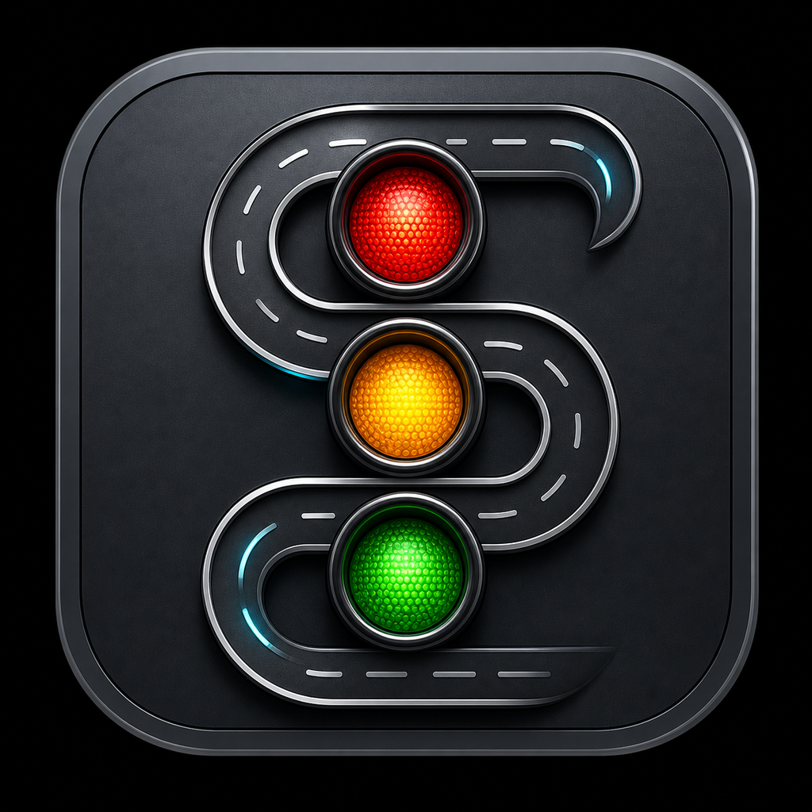
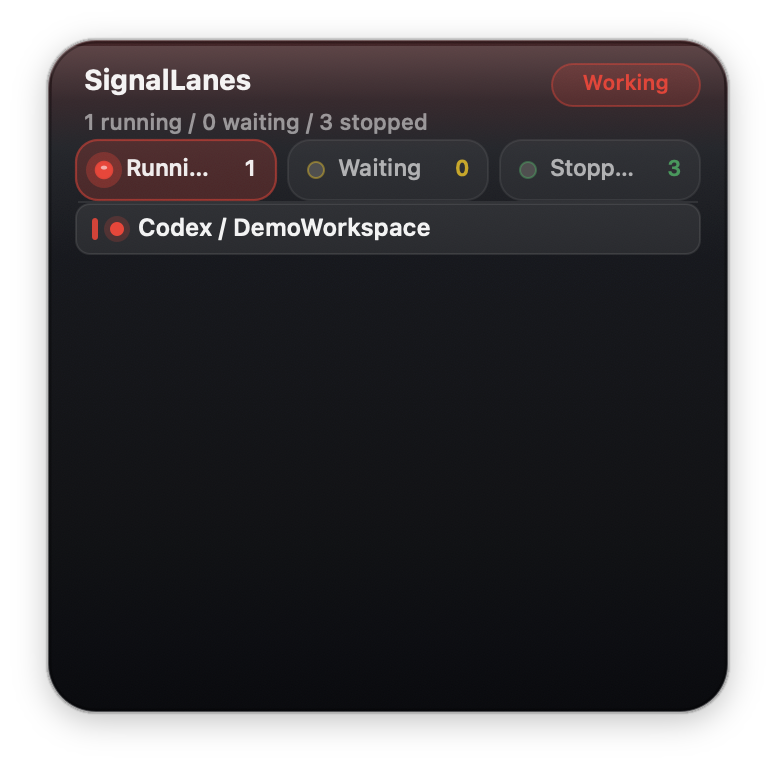
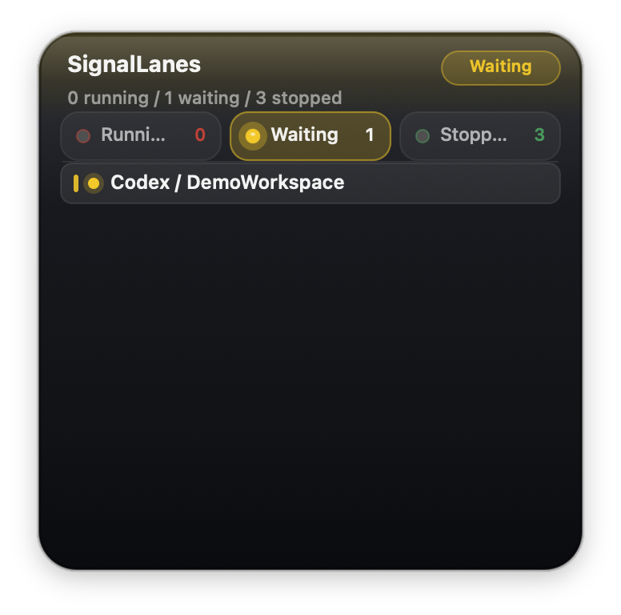
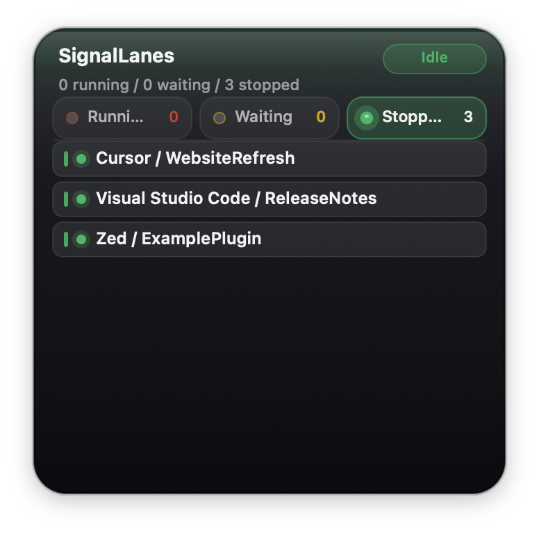

<p align="center">
  
</p>

# SignalLanes

[English](README.md) | [繁體中文](README.zh-Hant.md) | [简体中文](README.zh-Hans.md)

SignalLanes is a small macOS menu bar app and CLI for monitoring local AI coding agents and AI IDEs.

## Preview

These example screenshots use demo project names and do not show private local paths or real project data.

| Working | Waiting for permission | Idle |
| --- | --- | --- |
|  |  |  |

It shows a traffic-light status for the tools you are running locally:

- Green means no tracked agent appears to be working.
- Red means a tracked agent appears to be working.
- Yellow means a tracked agent appears to be waiting for permission, approval, or user input.

Yellow has the highest priority, then red, then green. If one tool is waiting for approval while another is running, SignalLanes shows yellow so the thing that needs your attention is visible first.

## Install for regular users

The easiest way for a non-developer to use SignalLanes is a macOS installer download from GitHub Releases.

1. Download `SignalLanes-<version>-macos-installer.pkg` from the latest release.
2. Open the installer package and follow the prompts.
3. Open `SignalLanes.app` from Applications.
4. Look for the traffic-light icon in the macOS menu bar. SignalLanes does not show a Dock icon.

The app does not require a server account, cloud sync, or browser extension. Open your AI coding tools as usual, and SignalLanes will update the menu bar light and floating panel from local signals.

The installer also installs `signallanesctl` to `/usr/local/bin/signallanesctl` for users who want CLI-based manual status overrides.

Alternative: download `SignalLanes-<version>-macos.zip`, unzip it, and drag `SignalLanes.app` into the Applications folder yourself.

If macOS says the app cannot be verified, the downloaded build is probably not signed and notarized yet. For a trusted test build, you can Control-click `SignalLanes.app`, choose Open, and confirm. Public releases should be code-signed and notarized with an Apple Developer account before being shared broadly.

Optional: if you want SignalLanes to switch to matching windows more precisely from the floating panel, choose Enable Precise Window Switching from the menu and grant Accessibility permission in System Settings.

## What it monitors

SignalLanes uses conservative local signals. It does not require a server account, cloud service, or browser extension.

Current automatic detection includes:

- Process snapshots from `ps`.
- CPU usage, runnable process state, and command-line keywords.
- Project paths and session IDs exposed in common command-line flags.
- Recent local session metadata for Codex and Claude Desktop.
- Recent Claude Code extension logs inside Antigravity, VS Code, Cursor, and Windsurf.
- Manual status overrides written by `signallanesctl`.

Built-in agent definitions currently include:

- Codex
- Claude Code
- Antigravity
- Cursor
- Windsurf
- Visual Studio Code
- Zed
- Xcode
- Aider
- Gemini CLI
- OpenCode
- Goose

## Requirements

- macOS 14 or newer.
- A Swift 6 toolchain, usually from a recent Xcode installation.
- Optional: Accessibility permission if you want more precise window switching from the floating panel.

## Run from source

From the repository root:

```sh
swift run SignalLanes
```

SignalLanes runs as a menu bar app. It does not show a Dock icon.

## Build the app bundle

Build a release app bundle and the CLI:

```sh
./Scripts/build-app.sh
```

Open the built app:

```sh
open .build/SignalLanes.app
```

The script creates:

- `.build/SignalLanes.app`
- `.build/release/signallanesctl`

The app bundle is a local development build. Release downloads may need code signing and notarization before macOS treats them like a normal distributed app.

## Build the installer package

Build an unsigned macOS installer package:

```sh
./Scripts/build-installer.sh 0.1.0
```

The installer package is written to:

```text
dist/SignalLanes-0.1.0-macos-installer.pkg
```

It installs:

- `SignalLanes.app` to `/Applications/SignalLanes.app`
- `signallanesctl` to `/usr/local/bin/signallanesctl`

For a signed package, set `SIGNALLANES_PKG_SIGN_ID` to a Developer ID Installer certificate name:

```sh
SIGNALLANES_PKG_SIGN_ID="Developer ID Installer: Example Name (TEAMID)" ./Scripts/build-installer.sh 0.1.0
```

Signed public releases should also be notarized before distribution.

## Package release downloads

Create installer and zip files that can be attached to a GitHub Release:

```sh
./Scripts/package-release.sh 0.1.0
```

The script creates:

- `dist/SignalLanes-0.1.0-macos-installer.pkg`
- `dist/SignalLanes-0.1.0-macos.zip`
- `dist/signallanesctl-0.1.0-macos.zip`

`SignalLanes-0.1.0-macos-installer.pkg` is the file most users should download. `SignalLanes-0.1.0-macos.zip` is available for manual drag-and-drop installation. `signallanesctl-0.1.0-macos.zip` is optional for users who only want the CLI.

## Menu bar app

When SignalLanes starts, it adds a traffic-light icon to the macOS menu bar and refreshes detection every 5 seconds.

Open the menu bar item to see:

- Overall status.
- Last scan time.
- Waiting for Permission tasks.
- Running tasks.
- Stopped tasks.
- Matching processes, CPU usage, session IDs, project paths, and status sources when available.

The menu also includes:

- Refresh Now
- Hide Floating Light / Show Floating Light
- Reset Floating Position
- Theme
- Display Size
- Language
- Enable Precise Window Switching
- Open Status Folder
- Quit SignalLanes

## Floating light

SignalLanes also shows a floating panel near the top of the screen by default.

You can:

- Drag it to move it.
- Click a status segment to filter the visible tasks.
- Scroll when there are more tasks than visible rows.
- Click a task row to try to activate the matching IDE or app.
- Change the theme and size from the menu bar menu.
- Switch the app language from the Language menu. English is the default, with Traditional Chinese and Simplified Chinese available.
- Reset its position from the menu bar menu.

The floating window uses a floating window level, so it stays above normal app windows while remaining below system UI such as the menu bar and system panels.

## CLI

The CLI is useful when an IDE or terminal does not expose enough state for automatic detection.

Run it from source:

```sh
swift run signallanesctl agents
swift run signallanesctl queue
swift run signallanesctl queue --all-known
swift run signallanesctl --lang zh-Hant queue --all-known
```

Or use the release binary after building:

```sh
.build/release/signallanesctl agents
.build/release/signallanesctl queue
```

English is the default CLI language. Use `--lang en`, `--lang zh-Hant`, or `--lang zh-Hans` to switch output language for a command. You can also set `SIGNALLANES_LANG`.

### List supported agent IDs

```sh
swift run signallanesctl agents
```

Use the left column as the `<agent-id>` for manual overrides.

### Show the current queue

```sh
swift run signallanesctl queue
```

This prints the overall status and task sections:

- Waiting for Permission
- Running
- Stopped

By default, the queue only includes detected or recently hinted tools. To include known tools that are currently idle or not open:

```sh
swift run signallanesctl queue --all-known
```

`status` is also accepted as an alias for the queue view:

```sh
swift run signallanesctl status --all-known
```

### Set a manual override

Use manual overrides when you know an agent is waiting, running, or idle but SignalLanes cannot infer that state automatically.

```sh
swift run signallanesctl set codex yellow "waiting for approval"
swift run signallanesctl set claude red --ttl 120 "running tests"
swift run signallanesctl set cursor green --no-expire "done"
```

Accepted state values include:

- `green`, `idle`, `done`, `complete`, `completed`
- `red`, `work`, `working`, `running`, `busy`
- `yellow`, `wait`, `waiting`, `permission`, `approval`

Overrides expire after 15 minutes by default.

Use `--ttl seconds` for a custom expiry:

```sh
swift run signallanesctl set codex yellow --ttl 300 "waiting for shell approval"
```

Use `--no-expire` for an override that stays until you clear it:

```sh
swift run signallanesctl set aider red --no-expire "long-running refactor"
```

### Clear a manual override

```sh
swift run signallanesctl clear codex
```

### List active manual overrides

```sh
swift run signallanesctl list
```

Manual overrides are stored at:

```text
~/.signal-lanes/status.json
```

The menu bar app and CLI both read the same file.

## Manual integration examples

You can integrate tools that SignalLanes does not detect yet by calling `signallanesctl` from scripts.

Example shell wrapper:

```sh
#!/usr/bin/env bash
set -euo pipefail

swift run signallanesctl set my-agent red --ttl 3600 "working"
trap 'swift run signallanesctl clear my-agent' EXIT

my-agent "$@"
```

Example approval hook:

```sh
swift run signallanesctl set codex yellow --ttl 600 "waiting for command approval"
```

When approval is handled:

```sh
swift run signallanesctl clear codex
```

Unknown agent IDs are allowed for manual overrides. They will appear using the ID as the display name.

## Privacy and local data

SignalLanes is local-first.

It reads local process information, selected command-line arguments, local session/log metadata for supported tools, and the local override file at `~/.signal-lanes/status.json`.

It does not send telemetry or project data to a server.

Be aware that the UI and CLI can display local project paths, session titles, session IDs, PIDs, and short command previews. That is useful for debugging and routing attention, but you should avoid sharing screenshots or logs publicly if they contain private project names or paths.

## Current limits

macOS does not provide a single public API for "this AI IDE is waiting for permission." Different tools expose status in different places, and some expose it only inside a terminal buffer, local app state, or private UI.

SignalLanes therefore combines:

- Automatic local heuristics.
- Tool-specific local session/log readers.
- Manual overrides.

This keeps the app simple and inspectable, but it also means detection can be imperfect. Future detectors can add tool-specific adapters without changing the menu bar UI or CLI workflow.

## Development

Build all products:

```sh
swift build
```

Run the smoke test executable:

```sh
swift run SignalLanesCoreSmokeTests
```

Build the app bundle:

```sh
./Scripts/build-app.sh
```

## Contributing

Contributions are welcome, especially:

- New detector adapters for additional AI IDEs and coding agents.
- More accurate status parsing for existing tools.
- Safer ways to detect waiting-for-permission states.
- Packaging, signing, release, and documentation improvements.

Please keep changes small, local, and easy to review. Detection code should prefer local, inspectable signals and avoid uploading project or process data anywhere.

## License

SignalLanes is released under the MIT License.
